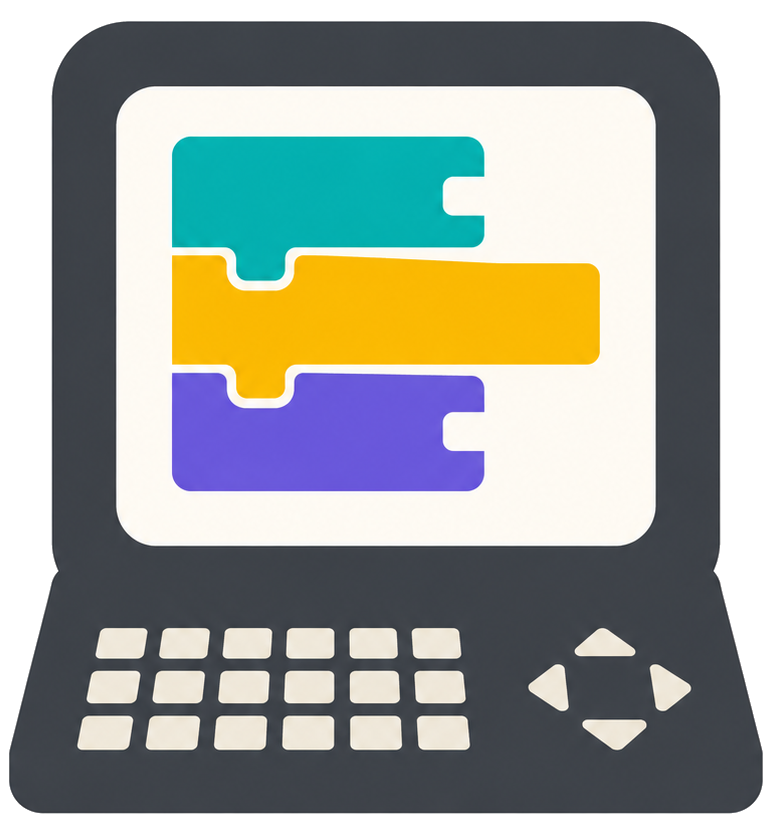
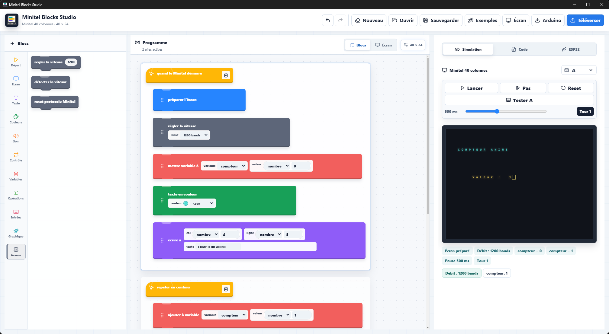
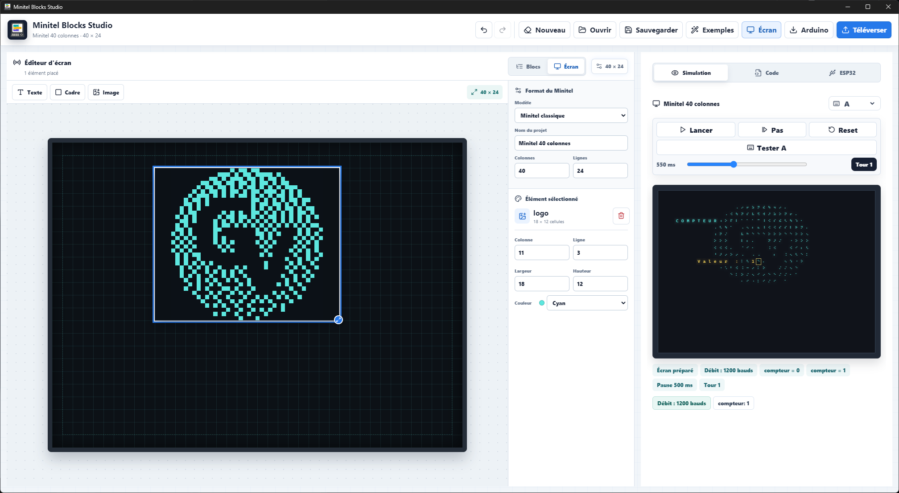
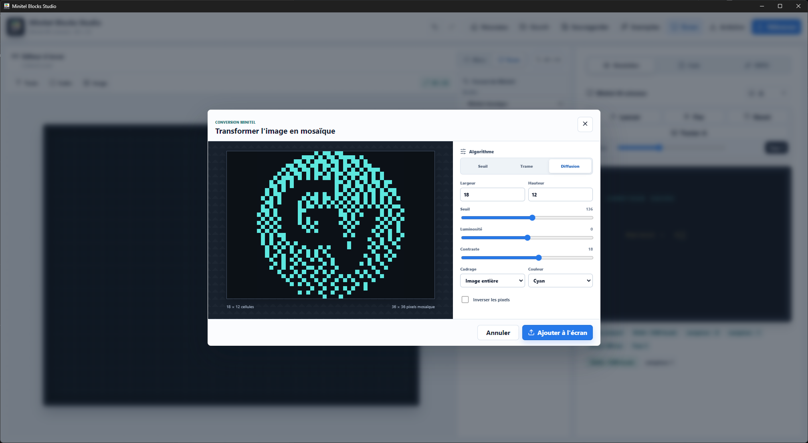
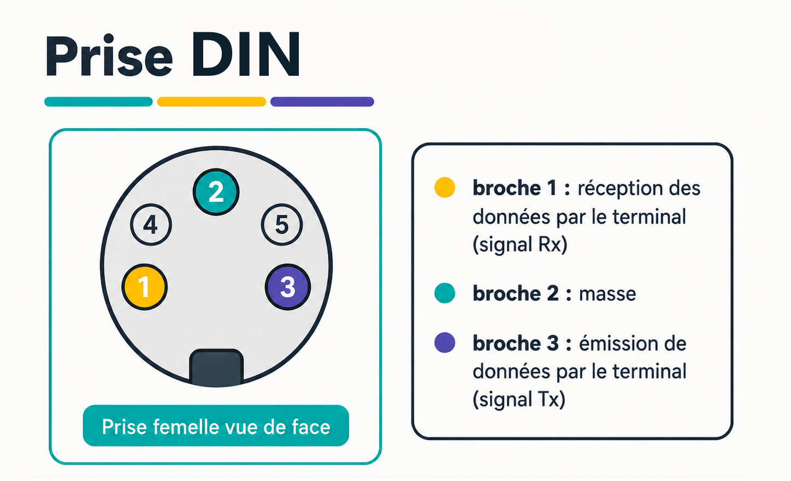

<table width="100%">
  <tr>
    <td width="100">
      
    </td>
    <td width="700" align="center">
      <h1>Minitel Blocks Studio</h1>
    </td>
  </tr>
</table>

Minitel Blocks Studio permet de créer des programmes pour un ESP32 qui pilote un Minitel, simplement en assemblant des blocs visuels. Aucun langage de programmation n'est nécessaire : les textes, couleurs, sons, touches, variables, boucles et conditions se construisent à la souris.



## Installer l'application

1. Ouvre la page **Releases** du projet.
2. Télécharge **Minitel Blocks Studio Setup**.
3. Lance le fichier téléchargé et suis l'installation.
4. Ouvre l'application depuis le menu Démarrer ou le raccourci du bureau.

L'installateur contient tout le nécessaire pour préparer et envoyer un programme vers l'ESP32. Arduino et PlatformIO ne sont pas requis.

## Profiter des mises à jour

À chaque démarrage, l'application recherche discrètement une nouvelle version lorsqu'une connexion Internet est disponible.

Si une mise à jour existe, elle se télécharge en arrière-plan sans interrompre le projet en cours. Une fois prête, l'application propose de redémarrer immédiatement ou de terminer l'installation plus tard. Aucun nouvel installateur n'est à rechercher manuellement.

## Découvrir l'interface

L'application est organisée en trois zones :

- à gauche, les blocs disponibles, rangés par catégorie ;
- au centre, le programme en blocs ou l'éditeur visuel de l'écran ;
- à droite, le Minitel simulé, le programme généré et l'envoi vers l'ESP32.

Le bouton **Exemples** propose plusieurs projets prêts à modifier : découverte, menu interactif, compteur animé, clavier sonore et affiche visuelle.

## Construire avec des blocs

Choisis une catégorie, puis fais glisser un bloc à l'endroit souhaité. Une ligne bleue indique exactement où il sera inséré, y compris entre deux blocs ou à l'intérieur d'une boucle.

Une suite reste attachée pendant son déplacement : le bloc tenu, les blocs placés après lui et ses contenus imbriqués se déplacent ensemble.

Chaque bloc propose des commandes pour :

- le monter ou le descendre ;
- le dupliquer ;
- le supprimer ;
- modifier directement ses textes, nombres, couleurs, variables ou conditions.

Dans la catégorie **Avancé**, le bloc **régler la vitesse** permet de choisir 300, 1200, 4800 ou 9600 bauds. Place-le dans la pile de démarrage à l'endroit où le changement doit avoir lieu. Le débit sélectionné apparaît aussi dans la simulation.

Le bloc **détecter la vitesse** peut faire ce choix automatiquement. Il interroge le Minitel avec une demande de statut, essaie plusieurs vitesses et conserve celle qui répond. Les fils RX et TX doivent tous les deux être raccordés pour recevoir la réponse du Minitel.

## Sauvegarder et retrouver un projet

Le bouton **Sauvegarder** crée un fichier de projet `.mbs`. Il conserve les blocs et leur ordre, les variables, le modèle de Minitel, les éléments placés dans l'éditeur d'écran et le modèle d'ESP32 choisi.

Le bouton **Ouvrir** restaure ce fichier dans l'application. Le projet précédent reste accessible avec **Annuler** juste après l'ouverture d'un autre projet.

Un fichier `.mbs` peut être déplacé sur une clé USB, envoyé à une autre personne ou conservé comme copie de sécurité.

## Composer l'écran visuellement

Passe de **Blocs** à **Écran** dans la barre située au-dessus de l'espace central.

Tu peux alors :

- choisir le format de ton Minitel ou définir une grille personnalisée ;
- ajouter et déplacer du texte sur la grille ;
- créer un cadre vide ou rempli ;
- placer, redimensionner et recolorer les éléments ;
- importer une image pour la transformer en mosaïque Minitel.

Les éléments créés dans ce mode apparaissent automatiquement dans la simulation et sont inclus lors de l'envoi vers l'ESP32.

## Importer une image

Dans le mode **Écran**, clique sur **Image**, puis choisis une image sur ton ordinateur.



Une fenêtre permet de préparer le résultat avant de l'ajouter :

- **Seuil** produit des formes nettes ;
- **Trame** crée un motif régulier ;
- **Diffusion** conserve davantage de détails ;
- la luminosité, le contraste et le seuil ajustent le rendu ;
- le cadrage, la taille, la couleur et l'inversion restent modifiables.



L'aperçu montre les pixels qui seront utilisés par le Minitel.

## Tester avec le Minitel simulé

L'onglet **Simulation** permet de vérifier le résultat avant l'envoi.

- **Lancer** fait tourner le programme.
- **Pas** avance d'une étape.
- **Reset** remet la simulation au début.
- **Tester A** déclenche la touche sélectionnée.
- Une touche du clavier, comme `A`, `B`, `Entrée` ou `Retour`, peut aussi être utilisée directement.

La simulation suit le format d'écran choisi dans le projet.

## Câbler l'ESP32 au Minitel



Le logiciel utilise le port série `Serial2` de l'ESP32 avec les broches suivantes :

- **GPIO 16** pour recevoir les données (`RX2`) ;
- **GPIO 17** pour envoyer les données (`TX2`) ;
- une broche **GND** pour la masse commune.

Le raccordement se fait avec seulement trois fils soudés, sans résistance externe :

```text
ESP32                                  PRISE DIN DU MINITEL

GND       --------------------------   broche 2 · GND
GPIO 17   -------- TX2 ----------->    broche 1 · RX
GPIO 16   <------- RX2 ------------    broche 3 · TX
```

RX et TX sont donc croisés : le fil qui part du TX de l'ESP32 arrive sur le RX du Minitel, et le TX du Minitel arrive sur le RX de l'ESP32.

Ne raccorde rien aux broches 4 et 5 de la prise DIN. En particulier, ne relie aucune alimentation 3,3 V ou 5 V entre les deux appareils : seuls **GND, RX et TX** sont utilisés.

## Envoyer sur l'ESP32

1. Branche l'ESP32 avec un câble USB adapté aux données.
2. Ouvre l'onglet **ESP32**.
3. Choisis le modèle de carte.
4. Le port apparaît automatiquement dès que la carte est reconnue.
5. Clique sur **Envoyer à l'ESP32**.

La progression affiche successivement la connexion, la compilation et l'envoi. Selon la carte, Windows peut demander une seule fois son pilote USB.

## Exporter vers Arduino

Le bouton **Arduino** crée un dossier Arduino complet. Il contient le programme et la bibliothèque Minitel personnalisée : aucune bibliothèque supplémentaire n'est à rechercher ou à installer.

Cet export est optionnel. Il sert uniquement à ouvrir ou modifier le programme dans Arduino IDE ; l'envoi direct depuis Minitel Blocks Studio fonctionne sans Arduino.

## Raccourcis

- `Ctrl+S` : sauvegarder le projet.
- `Ctrl+O` : ouvrir un projet.
- `Ctrl+Z` : annuler.
- `Ctrl+Y` ou `Ctrl+Shift+Z` : rétablir.
- `Échap` : annuler un déplacement ou fermer la fenêtre des exemples.
- Dans la simulation, appuie directement sur une touche pour la tester.

## En cas de problème

- Utilise **Reset** si la simulation semble déjà avancée.
- Vérifie le câble USB, le modèle de carte et le port si l'envoi échoue.
- Vérifie le branchement entre l'ESP32 et le Minitel si l'écran reste vide.
- Commence avec un exemple, puis modifie-le petit à petit.

## Remerciements

Je remercie [Nat](https://github.com/NathaanTFM) pour son aide ainsi que pour son dépôt [NathaanTFM/minitel-project](https://github.com/NathaanTFM/minitel-project), qui m'ont permis de mieux comprendre le fonctionnement du Minitel.

## Licence

Minitel Blocks Studio est distribué sous licence Apache-2.0.
